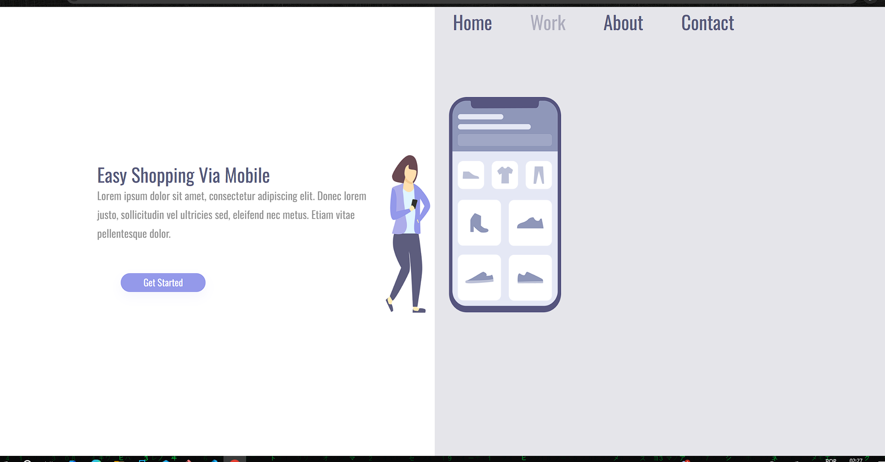
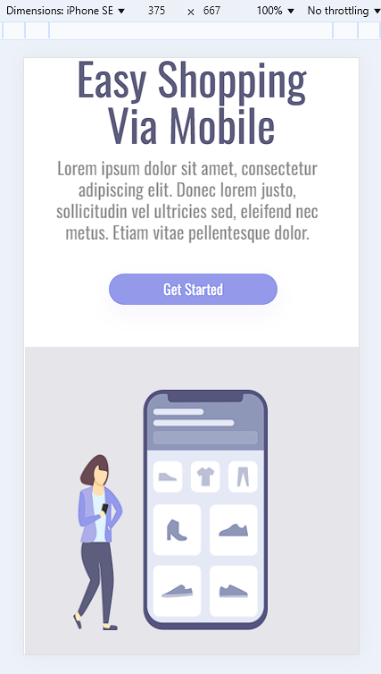

# shopping-easy
<H2>Esse foi o primeiro projeto proposto pelo Dev Club que desenvolvi.</H2>
<h3>Durante o desenvolvimento pude aumentar meu entendimento e habilidades em HTML e principalmente no CSS.

• Ao estruturar o conteúdo, aprendi sobre a importância da semântica e da organização do código, o que torna o desenvolvimento web mais eficiente e acessível. Além de tudo, a ênfase na estilização permitiu explorar novas técnicas de design, melhorando a estética e a usabilidade da página.</h3>
 
